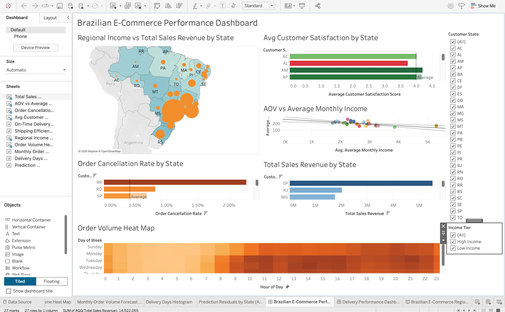
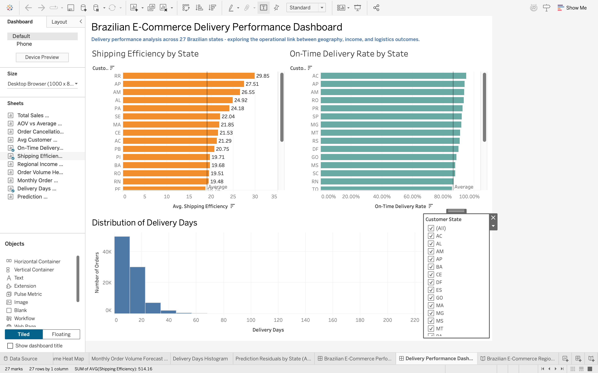

# Brazilian E-Commerce Analytics Dashboard

Interactive Tableau dashboard analyzing regional sales performance and 
delivery efficiency across 27 Brazilian states, using the Olist 
Brazilian E-Commerce dataset integrated with IBGE socioeconomic data.

## Live Dashboards

| Dashboard | Link |
|-----------|------|
| 📊 E-Commerce Performance Dashboard | [View on Tableau Public](https://public.tableau.com/app/profile/saisupriya.ranga/viz/BrazilianE-CommercePerformanceDashboard/BrazilianE-CommercePerformanceDashboard) |
| 🚚 Delivery Performance Dashboard | [View on Tableau Public](https://public.tableau.com/app/profile/saisupriya.ranga/viz/BrazilianE-CommerceDeliveryPerformanceDashboard/DeliveryPerformanceDashboard) |
| 📖 Regional Performance Storyboard | [View on Tableau Public](https://public.tableau.com/app/profile/saisupriya.ranga/viz/BrazilianE-CommerceRegionalPerformanceStoryboard/BrazilianE-CommerceRegionalStory) |

## Research Question

How can an e-commerce company improve sales performance and customer 
satisfaction by analyzing the extent to which regional socio-economic 
factors — specifically average monthly income — influence purchasing 
behavior (AOV), order cancellation rates, and delivery expectations 
within the Brazilian e-commerce market?

## Dataset

- **Source:** Olist Brazilian E-Commerce Public Dataset (Kaggle)
- **Size:** 1M+ rows across 9 relational tables
- **Enriched with:** IBGE Monthly Income by Brazilian States
- **Key challenge:** Geographic normalization resolved by adding 
  State Code mapping column to IBGE dataset for stable cross-dataset 
  joins in Tableau
- **Data cleaning:** Geolocation table reduced from 1M+ to ~19K rows 
  by removing duplicates in Excel

## Tools and Techniques

- Tableau Desktop and Tableau Public
- Multi-table data relationships (9 tables)
- Calculated KPI fields built from scratch
- Income Tier segmentation (High/Low) using calculated dimensions
- Linear regression trend line with statistical output
- Exponential smoothing forecast (Holt-Winters additive model)
- Manual residual plot via calculated field

## Key Metrics Tracked

| KPI | Type | Formula |
|-----|------|---------|
| Total Sales Revenue | Aggregate | SUM(payment_value) |
| Average Order Value (AOV) | Ratio | SUM(payment_value) / COUNTD(order_id) |
| Order Cancellation Rate | Conditional ratio | COUNTD(canceled orders) / COUNTD(all orders) |
| On-Time Delivery Rate | Conditional ratio | COUNTD(on-time orders) / COUNTD(delivered orders) |
| Average Customer Satisfaction | Aggregate | AVG(review_score) |
| Shipping Efficiency | Date difference | DATEDIFF(purchase → delivery) |

## Dashboard Overview

- **2 interactive dashboards** — E-Commerce Performance and Delivery Performance
- **1 storyboard** — Regional Performance narrative across 5 story points
- **10+ sheets** across all workbooks
- **6 KPIs** built from scratch using calculated fields
- **2 global filters** — Customer State and Income Tier
- **Cross-sheet filtering** — selecting any state updates all charts simultaneously

## Key Findings

- São Paulo generates nearly R$6M in revenue — over twice the second-ranked state (RJ)
- **Counterintuitive:** Higher-income states spend LESS per order (AOV = -0.0252 × Income + 266.86, R² = 0.357, p = 0.001)
- Roraima (RR) has a 2.17% cancellation rate — nearly 4× the national average
- Low-income northern states consistently show higher cancellation rates AND lower satisfaction scores
- Peak order volume: Tuesday–Friday, 10am–4pm
- Forecast projects monthly orders reaching 10,000–11,000 by April 2019

## Screenshots
### E-Commerce Performance Dashboard

### Delivery Performance Dashboard

